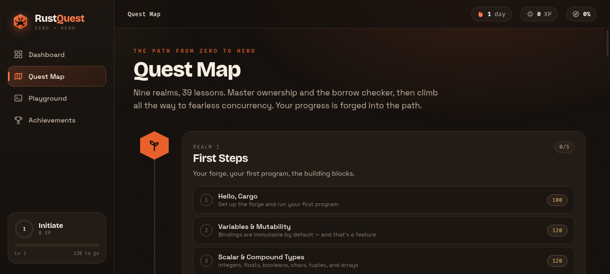

# RustQuest — Learn Rust from Zero to Hero

A gamified, hands-on web app for learning Rust. Work through **12 realms / 53
lessons** of interactive content — read, run simulated code, fill in blanks,
take quizzes, earn XP, climb levels, and unlock badges. Progress is saved
locally in the browser.



## Running it

The app is a **zero-build** static site (React + Babel are loaded from a CDN and
JSX is compiled in the browser). It must be served over HTTP — opening
`index.html` from `file://` won't work because Babel fetches the `.jsx` files.

```bash
# from the project root — defaults to port 9101
./scripts/serve.sh
# or directly:
python3 -m http.server 9101
# then open http://localhost:9101
```

Any static server works (`npx serve -l 9101`, `php -S localhost:9101`, etc.).

## Features

- **Quest Map** — all 12 realms on a forged path, with per-lesson XP and progress.
- **Lessons** — prose, annotated code, callouts (tip/warn/note), a runnable
  **playground**, **fill-in-the-blank** challenges, a scored **quiz**, and takeaways.
- **Playground** — an in-browser, simulated Rust compiler: it streams a realistic
  `cargo run` log and the program's output. (It does not execute real Rust; each
  snippet ships with its expected output.)
- **Gamification** — XP, 8 level tiers (Initiate → Rust Hero), daily streak, and
  10 unlockable badges.
- **Persistence** — progress is stored in `localStorage`; reset from the
  Achievements page.

## The curriculum (12 realms)

| # | Realm | Focus |
|---|-------|-------|
| 1 | First Steps | Cargo, variables, types, functions, control flow |
| 2 | Ownership | Move semantics, borrowing, slices, stack/heap/drop |
| 3 | Structs & Enums | Structs, methods, enums, pattern matching, `Option` |
| 4 | Collections & Errors | `Vec`, strings, `HashMap`, `Result`/`?`, `panic!` |
| 5 | Traits & Generics | Generics, traits, trait objects, lifetimes |
| 6 | Fearless Concurrency | Threads, channels, `Arc`/`Mutex`, async |
| 7 | Closures & Iterators | Closures, the `Iterator` trait, adapters, functional patterns |
| 8 | Smart Pointers | `Box`, `Rc`, `RefCell`, `Deref`/`Drop` |
| 9 | Modules, Crates & Testing | Modules, crates, tests, a capstone CLI |
| 10 | Advanced Patterns & Traits | Deep `match`, associated types, operator overloading, supertraits, newtype, advanced types |
| 11 | Macros & Unsafe Rust | `macro_rules!`, derive/proc macros, `unsafe`, raw pointers, FFI |
| 12 | Async & Real-World Rust | Async/await, Tokio, idiomatic errors, tooling/workspaces, a web-service capstone |

## Project structure

```
index.html                     # loads fonts, CDN libs, data, then components
css/styles.css                 # "Molten Forge" design system
js/
  highlight.js                 # dependency-free Rust syntax highlighter
  curriculum-core.js           # window.RUSTQUEST = { levels, badges, modules:[] }
  realms/realm-N-*.js          # one module each, appended in order
  icons.jsx                    # Icon + BrandMark; declares shared React hooks
  ui.jsx                       # Ring, Pill, CodeBlock, Callout, toasts, confetti
  playground.jsx               # editor + simulated runner + fill-in-the-blank
  quiz.jsx                     # scored multi-question quiz
  store.jsx                    # progress + routing (Context, localStorage)
  views.jsx                    # Dashboard, QuestMap, Achievements, PlaygroundPage
  lesson.jsx                   # lesson renderer (blocks → components)
  app.jsx                      # shell (sidebar, topbar, router) + mount
scripts/validate-curriculum.js # structural validator for the curriculum data
docs/                          # architecture + content-authoring guide
```

## Adding or editing lessons

All learning content lives in `js/realms/realm-*.js` as plain data — no React
needed. See [`docs/content-authoring-guide.md`](docs/content-authoring-guide.md)
for the block schema and rules, then validate:

```bash
node scripts/validate-curriculum.js
```

It checks all 12 realms load, every block is well-formed, quiz answer indices are
in range, and — importantly — that each playground's required tokens actually
appear in its starter code.
